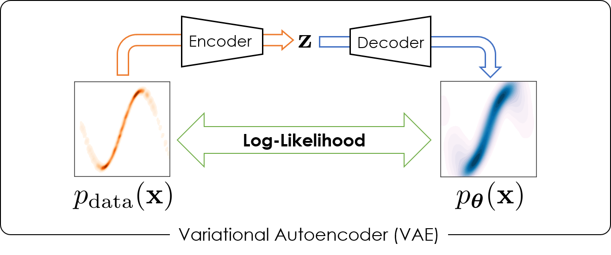
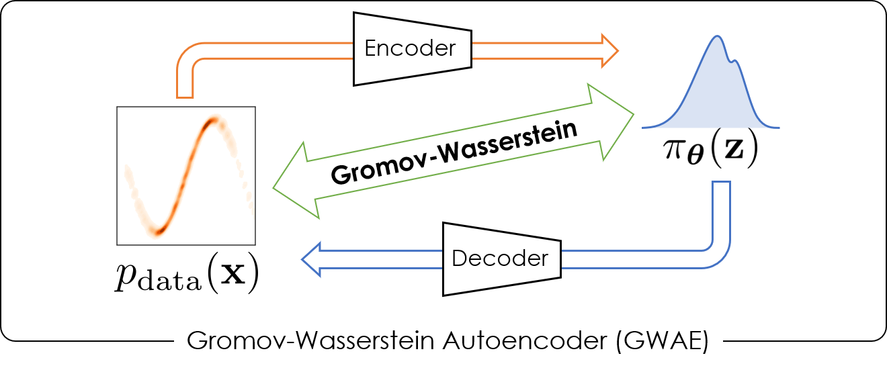

# Gromov-Wasserstein Autoencoders (GWAE)

This repository contains the official implementation for ["Gromov-Wasserstein Autoencoders" (ICLR 2023)](https://openreview.net/forum?id=sbS10BCtc7).

Gromov-Wasserstein Autoencoders (GWAEs) learn representations by a relaxed Gromov-Wasserstein (GW) objective on a variational autoencoding model.
The GW metric yields the objective directly aiming at representation learning, and the variational autoencoding model provides a stable way of stochastic training using autoencoding.
More details are presented in our paper [(pdf)](https://openreview.net/pdf?id=sbS10BCtc7).

<table>
    <tr>
        <td>
            
        </td>
        <td>
            
        </td>
    </tr>
</table>

## BibTeX citation
If you use this code in your work, please cite our paper as follows:
```bibtex
@inproceedings{Nakagawa2023,
    title={{Gromov-Wasserstein} Autoencoders},
    author={Nao Nakagawa and Ren Togo and Takahiro Ogawa and Miki Haseyama},
    booktitle={Proceedings of International Conference on Learning Representations (ICLR)},
    year={2023},
    url={https://openreview.net/forum?id=sbS10BCtc7}
}
```

## Installation
We developed and tested this code in the environment as follows:

- Ubuntu 22.04
- Python3.10
- CUDA 11.8
- 1x GeForce® RTX 2080 Ti
- 31.2GiB (32GB) RAM

We recommend to run this code under the `venv` envirionment of Python 3.10.
The requirements can be easily installed using `pip`.
```
$ python3.10 -m venv .env
$ source .env/bin/activate
(.env) $ pip install -U pip
(.env) $ pip install wheel
(.env) $ pip install -r requirements.txt
```
In `requirements.txt`, a third-party representation learning package is specified, which is downloaded from `github.com` and installed via `pip`.

## How to Train
Run `train.py` with a setting file to train models.
```
(.env) $ python train.py setting/gwae.yaml
(.env) $ python train.py setting/vae.yaml
(.env) $ python train.py setting/geco.yaml
(.env) $ python train.py setting/ali.yaml
...
```
The results are saved in the `logger_path` directory specified in the setting YAML file.

## How to Evaluate GWAEs
Run `vis.py` with the `logger_path` directory specified in the settings.
```
(.env) $ python vis.py runs/celeba_gwae
```

## How to Evaluate Models with FID
To compute the generation FID, run `fid.py` with the `logger_path` directory path.
```
(.env) $ python fid.py runs/celeba_gwae
```
*Note*: The script `fid.py` calculates the FID score of the images sampled from *the generative model*. On the other hand, the FID values computed by [the `vaetc` package](https://github.com/ganmodokix/vaetc) is *reconstruction* FID, using the test set images for generating *reconstructed* images.
